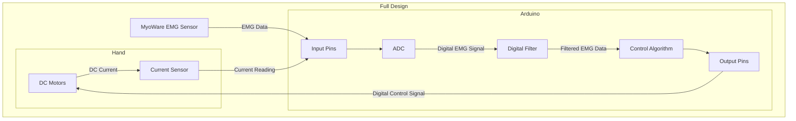

## Full Design of Arduino System
The following outlines the full design of the EMG-Data Acquisition System

### Components
- MyoWare EMG Sensor
- Arduino R3
- DC Motors
- Current Sensors
- 5V Battery

