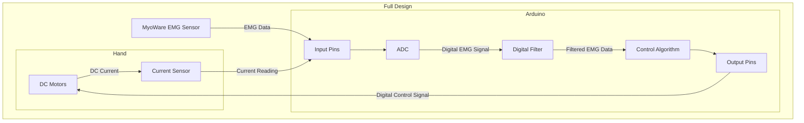

## Full Design of Arduino System
The following outlines the full design of the EMG-Data Acquisition System

### Hardware Components
- [MyoWare EMG Sensor](https://myoware.com/products/muscle-sensor/)
- [Arduino R3](https://store.arduino.cc/products/arduino-uno-rev3?srsltid=AfmBOoomeKbo_HNUKn9RDlytncmMrz4883O9ouOAUkNsl1cv23ON0Frv)
- [DC Motors](https://www.amazon.com/MG995-Geared-Helicopter-Arduino-Project/dp/B0D7M4LHBP/ref=sr_1_4?crid=VHH8LLZITWFU&dib=eyJ2IjoiMSJ9.hVLAM4yJqlfb8h01LQPwqPHBpldeT-OWZSH1Xqwes_7oIvepC8wKU1wEW1gQT6l2J5pSCUXsFibgAoA2JaqMvnqLpbWY88K6y5Bw7RM4SPiOWWc4O2eVrQro_y32JnpcRyfj3L0QqDVtkOH7xEFNMyj-OD7HJA-OzoLV_z6KAcmdmVKJclf-PROqJDmoRluLC9diXeup2qi44WAf4ofjfoboRbmfS08fq6UgHNG5X2XsdZihM_wIdodK4m54GnrgkeQU21s-r8mQOJ-5rwI949YdzwNvjEE4PP_hqZoLq8xwLfXHl-Vxccx0UUurRE50zQxSHsd1xMf3ug_A0ROCk-n8iqhjxGlTexEdNVD_sVE.DI9g8yIVYQ8cXFnoe7g4dyQ1i5eAfgwEWcRdhm5dqo0&dib_tag=se&keywords=6pcs%2BMG995%2B55G%2Bmicro%2Bservo%2Bmotor%2Bmetal%2Bgeared%2Bmotor%2Bkit&qid=1738699612&s=toys-and-games&sprefix=6pcs%2Bmg995%2B55g%2Bmicro%2Bservo%2Bmotor%2Bmetal%2Bgeared%2Bmotor%2Bkit%2Ctoys-and-games%2C83&sr=1-4&th=1)
- [Current Sensors](https://www.amazon.com/UMLIFE-Current-Detector-ACS712ELC-Amperage/dp/B091Y2V3G7/ref=sr_1_3?crid=2GNTWDOA85J0T&dib=eyJ2IjoiMSJ9.HvV2KPdhpyWtyjpRALJ3Fpp49_pw1VTcM1XHHkJBAtO-_PWY10_1SwhYdlYyqdmc6atqoxZF1yk9jfqKa3aVZ1lW3cL-YOpTfPSJPNjuQK8ToR8xdledTNkGTZ_TY2YGjuh107X2Q-EDJL0wbI4ejA0Gpxhq1b_kgqv4oHzK9Mih0tAa8M4q04ujikwtWnNjGIhGrOw1O6p9ADx1295kwDXA3iVdUS-pOshkPvUvMLc.dvBSNYpFSS1BlTdt5PKDdTZYYx2TcMC_nDATcuPRotI&dib_tag=se&keywords=acs712%2Bcurrent%2Bsensor&qid=1737063190&sprefix=ACS712%2Caps%2C121&sr=8-3&th=1)
- [5V Battery](https://www.amazon.com/Batteries-RECHARGED-Wireless-Security-Flashlights/dp/B09KRW2W4T/ref=sxin_16_pa_sp_search_thematic_sspa?content-id=amzn1.sym.c5787da2-212d-48eb-a894-9ea5a87adeb3%3Aamzn1.sym.c5787da2-212d-48eb-a894-9ea5a87adeb3&crid=2ITUI25C1QMEC&cv_ct_cx=rechargeable+7V+batteries&keywords=rechargeable+7V+batteries&pd_rd_i=B09KRW2W4T&pd_rd_r=254d4f8e-7674-44bc-9cca-4e4146c912a6&pd_rd_w=rN62y&pd_rd_wg=TUASP&pf_rd_p=c5787da2-212d-48eb-a894-9ea5a87adeb3&pf_rd_r=XAHVEKC90NSXBJY85MG6&qid=1738699698&sbo=RZvfv%2F%2FHxDF%2BO5021pAnSA%3D%3D&sprefix=rechargeable+7v+batterie%2Caps%2C117&sr=1-2-6024b2a3-78e4-4fed-8fed-e1613be3bcce-spons&sp_csd=d2lkZ2V0TmFtZT1zcF9zZWFyY2hfdGhlbWF0aWM&psc=1)

### Design Components
- [Digital Filter](FilterDesign.md)
- [Control Algorithm](ControlAlgorithmDesign.md)

