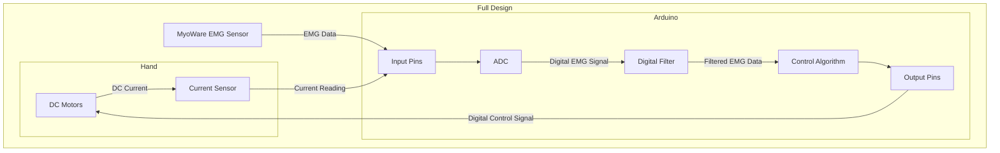

## Full Design of Arduino System

The following outlines the full design of the EMG-Data Acquisition System

### Hardware Components
- [MyoWare EMG Sensor](https://myoware.com/products/muscle-sensor/)
- [Arduino R3](https://store.arduino.cc/products/arduino-uno-rev3?srsltid=AfmBOoomeKbo_HNUKn9RDlytncmMrz4883O9ouOAUkNsl1cv23ON0Frv)
- [DC Motors](https://www.amazon.com/dp/B01HSX1IDE?ref_=pe_125775000_1044873430_fed_asin_title&th=1)
- [Current Sensors](https://www.amazon.com/UMLIFE-Current-Detector-ACS712ELC-Amperage/dp/B091Y2V3G7/ref=sr_1_3?crid=2GNTWDOA85J0T&dib=eyJ2IjoiMSJ9.HvV2KPdhpyWtyjpRALJ3Fpp49_pw1VTcM1XHHkJBAtO-_PWY10_1SwhYdlYyqdmc6atqoxZF1yk9jfqKa3aVZ1lW3cL-YOpTfPSJPNjuQK8ToR8xdledTNkGTZ_TY2YGjuh107X2Q-EDJL0wbI4ejA0Gpxhq1b_kgqv4oHzK9Mih0tAa8M4q04ujikwtWnNjGIhGrOw1O6p9ADx1295kwDXA3iVdUS-pOshkPvUvMLc.dvBSNYpFSS1BlTdt5PKDdTZYYx2TcMC_nDATcuPRotI&dib_tag=se&keywords=acs712%2Bcurrent%2Bsensor&qid=1737063190&sprefix=ACS712%2Caps%2C121&sr=8-3&th=1)
- [5V Battery](https://www.amazon.com/Batteries-RECHARGED-Wireless-Security-Flashlights/dp/B09KRW2W4T/ref=sxin_16_pa_sp_search_thematic_sspa?content-id=amzn1.sym.c5787da2-212d-48eb-a894-9ea5a87adeb3%3Aamzn1.sym.c5787da2-212d-48eb-a894-9ea5a87adeb3&crid=2ITUI25C1QMEC&cv_ct_cx=rechargeable+7V+batteries&keywords=rechargeable+7V+batteries&pd_rd_i=B09KRW2W4T&pd_rd_r=254d4f8e-7674-44bc-9cca-4e4146c912a6&pd_rd_w=rN62y&pd_rd_wg=TUASP&pf_rd_p=c5787da2-212d-48eb-a894-9ea5a87adeb3&pf_rd_r=XAHVEKC90NSXBJY85MG6&qid=1738699698&sbo=RZvfv%2F%2FHxDF%2BO5021pAnSA%3D%3D&sprefix=rechargeable+7v+batterie%2Caps%2C117&sr=1-2-6024b2a3-78e4-4fed-8fed-e1613be3bcce-spons&sp_csd=d2lkZ2V0TmFtZT1zcF9zZWFyY2hfdGhlbWF0aWM&psc=1)

## Public Methods
- ***void setup()***
  - Function: 
    - Called at runtime, setting initial Serial port and attaching Servos to their specified ports
  
- ***void loop()***
  - Function:
    - Looped indefinitely
    - Has complete algorithm

- ***int ReadInput(int pinNumber)***
    - Function:
        - Calls the private ***_TryReadInput*** method 
        - Only returns a value if ***_TryReadInput*** was successful
    - Arguments:
        - pinNumber (int): the specific input pin that is read from
    - Returns:
        - int: digital value from pin

- ***float Filter(int data)***
  - Function:
    - Public method for filtering the digital data. Calls the private filtering method.
    - Ensures that the data is properly filtered, even if errors occur.
  - Arguments:
    - data (int): the digital data passed which needs to be filtered
  - Returns:
    - float value of filtered data

- ***void ControlMotors(float filteredSignal, int sensorReadings[])***
  - Function:
      - Full control algorithm for motors
  - Arguments:
      - filteredSignal (float): Filtered EMG data
      - sensorReadings (ints): Current sensor readings

## Private Methods
- ***Pair _TryFilter(int data)***
  - Function:
    - Attempts to filter the given data using a specific voltage threshold.
  - Arguments:
    - data (int): The raw EMG data 
  - Returns:
    - Returns a boolean indicating if filtering was successful, and the filtered value in a range from 0 to 1023.
    
- ***Pair _TryReadInput(int pinNumber)***
    - Function:
        - Reads the analog input value at a specified pin
    - Arguments:
        - pinNumber(int): the specific pin that is read from
    - Returns:
        - bool: whether or not the read was sucessful
        - float: the value read from the pin as a float

### Design Components
- [Digital Filter](https://github.com/PeteMillians/Senior-Design/blob/Add-Design/docs/FilterDesign.md)
- [Control Algorithm](https://github.com/PeteMillians/Senior-Design/blob/Add-Design/docs/ControlAlgorithmDesign.md)

## Algorithm

```c++

const int EMG_PIN = A0;

struct Pair {
    bool success;
    float data;

    Pair(bool s, float d) : success(s), data(d) {}
};

void setup() {

    .
    .
    .

}

.
.
.

void loop() {

    .
    .
    .

    float rawSignal = ReadInput(EMG_PIN);

    /* Filter signal */

    /* Control Algorithm */
    
    delay (100);    // 100 ms delay
}

float ReadInput(int pinNumber) {
    /* 
    - Function:
        - Calls the private ***_TryReadInput*** method 
        - Only returns a value if ***_TryReadInput*** was successful
    - Arguments:
        - pinNumber (int): the specific input pin that is read from
    - Returns:
        - int: digital value from pin
    */

    Pair input = _TryReadInput(pinNumber);
    if (!input.success) {
        Serial.println("Error reading input from pin" + String(pinNumber));
        return 0.0;
    }

    return int(input.data);
}

Pair _TryReadInput(int pinNumber) {
    /* 
    - Function:
        - Reads the analog input value at a specified pin
    - Arguments:
        - pinNumber(int): the specific pin that is read from
    - Returns:
        - bool: whether or not the read was sucessful
        - float: the value read from the pin as a float
    */
   
    Pair input(false, 0.0); // Instantiate bad input value in case an error occurs

    float value = analogRead(pinNumber); // Input value in Volts

    input.success = true;  
    input.data = value;

    return input;
}
    

```

